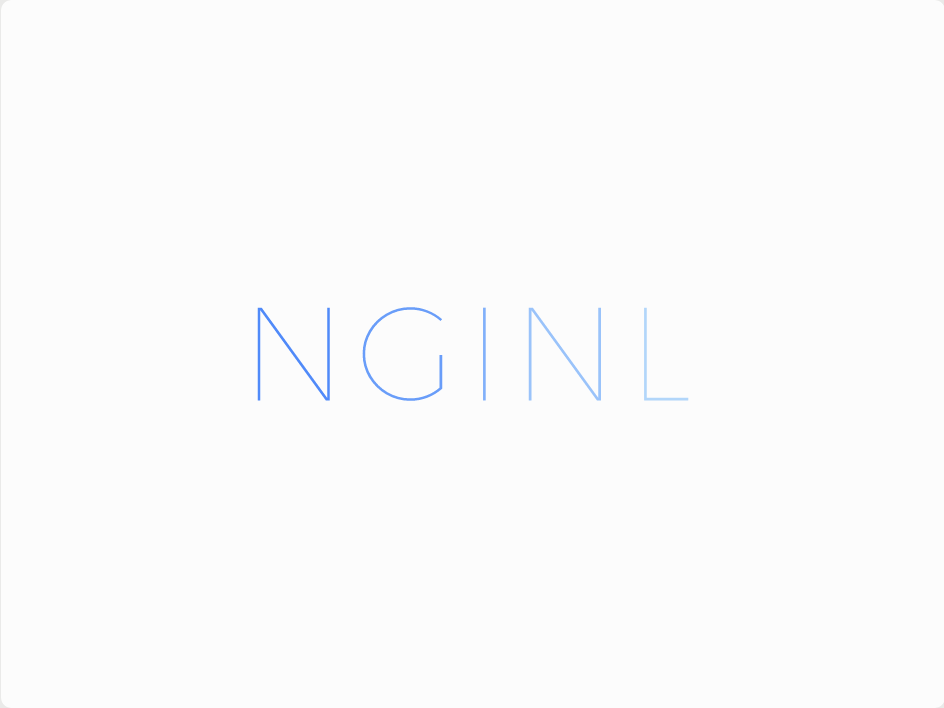

<div id="top"></div>

[![Contributors][contributors-shield]][contributors-url]
[![Forks][forks-shield]][forks-url]
[![Stargazers][stars-shield]][stars-url]
[![Issues][issues-shield]][issues-url]
[![MIT License][license-shield]][license-url]


<!-- PROJECT LOGO -->
<div align="center">
  <a href="https://github.com/LilianSchall/NginL">
    
  </a>

  <h3 align="center">NginLite</h3>
  <p align="center">
    This is the official repository of the NginL webserver
    <a href="https://github.com/LilianSchall/NginL"><strong>Explore the docs »</strong></a>
    <a href="https://github.com/LilianSchall/NginL/">View Demo</a>
    ·
    <a href="https://github.com/LilianSchall/NginL/issues">Report Bug</a>
    ·
    <a href="https://github.com/LilianSchall/NginL/issues">Request Feature</a>
  </p>
</div>


<!-- TABLE OF CONTENTS -->
<details>
  <summary>Table of Contents</summary>
  <ol>
    <li>
      <a href="#about-the-project">About The Project</a>
      <ul>
        <li><a href="#built-with">Built With</a></li>
      </ul>
    </li>
    <li>
      <a href="#getting-started">Getting Started</a>
      <ul>
        <li><a href="#prerequisites">Prerequisites</a></li>
        <li><a href="#installation">Installation</a></li>
      </ul>
    </li>
    <li><a href="#features">Features</a></li>
    <li><a href="#license">License</a></li>
    <li><a href="#contact">Contact</a></li>
  </ol>
</details>

<!-- ABOUT THE PROJECT -->
## About The Project

NginL is an open-source project made in order to learn about network programming, specifically learn how to build a webserver that follows the HTTP/1.1 protocol and the associated RFC specifications. 
NginL is a non persistant webserver daemon that can host multiple webpages simultaneously.
<p align="right">(<a href="#top">back to top</a>)</p>

### Built With

This project has been built only in standard C99.

<p align="right">(<a href="#top">back to top</a>)</p>

<!-- GETTING STARTED -->
## Getting Started

To get a local copy up and running follow these simple example steps.

### Prerequisites

In order to compile the project you will mainly need two specific utils:
  ```sh
    GNUMake
  ```
  ```sh
    gcc
  ```  

### Installation

1. Clone the repo
   ```sh
   git clone https://github.com/LilianSchall/NginL.git
   ```
2. In the repo, compile the project.
   ```sh
   make
   ```
3. Make a conf file in order to set up your webserver, an example can be found right <a href="https://github.com/LilianSchall/Mircle/example/example.conf/"> here </a>
4. Run the web server !
  ```sh
    ## will run the server in foreground:
    ./nginl server.conf
    ## or you can interact with it in background in the following ways:
    ./nginl [--dry-run] [start | restart | reload | stop] server.conf
  ```

<p align="right">(<a href="#top">back to top</a>)</p>


<!-- FEATURES -->
## Features

NginL has the following features implemented:
1. It is a multithreaded webserver which can support stress-tests up to 10000 simulteanous connections.
2. It can host multiple virtual hosts. Each of those can point out to a separate webpage to serve.
3. NginL is currently not a persistant webserver, so after it interacted with a client, it closes the connexion with the remote.

<p align="right">(<a href="#top">back to top</a>)</p>

<!-- LICENSE -->
## License

Distributed under the GPL 3.0 License. See `LICENSE` for more information.

<p align="right">(<a href="#top">back to top</a>)</p>


<!-- CONTACT -->
## Contact

Lilian Schall - [@LilianSchall](https://twitter.com/LilianSchall)

Project Link: [https://github.com/LilianSchall/NginL](https://github.com/LilianSchall/NginL)

<p align="right">(<a href="#top">back to top</a>)</p>

[contributors-shield]: https://img.shields.io/github/contributors/LilianSchall/NginL.svg?style=for-the-badge
[contributors-url]: https://github.com/LilianSchall/NginL/graphs/contributors
[forks-shield]: https://img.shields.io/github/forks/LilianSchall/NginL.svg?style=for-the-badge
[forks-url]: https://github.com/LilianSchall/NginL/network/members
[stars-shield]: https://img.shields.io/github/stars/LilianSchall/NginL.svg?style=for-the-badge
[stars-url]: https://github.com/LilianSchall/NginL/stargazers
[issues-shield]: https://img.shields.io/github/issues/LilianSchall/NginL.svg?style=for-the-badge
[issues-url]: https://github.com/LilianSchall/NginL/issues
[license-shield]: https://img.shields.io/github/license/LilianSchall/NginL.svg?style=for-the-badge
[license-url]: https://github.com/LilianSchall/NginL/blob/main/LICENSE
